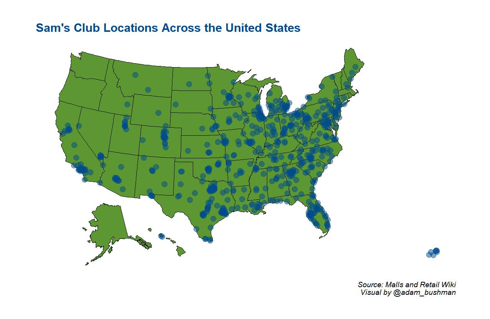

# Webscraping for Sam's Club Addresses

An R file for taking Sam's Club addresses from a previous web scraping project and visualizing their location across the US.

## Description

Our family are frequentists at Sam's Club. We enjoy the selection and you can't beat the club prices on gas and other items. After taking a recent road trip
up the East Coast, we got to thinking about how we might consider the presence of Sam's Club locations were we to ever move?

I set off to grab club location data and web scrapped them for this visualization project. Check out the 
[Sam's Club Location Web Scraping](https://github.com/adambushman/web-scrape-addresses) project. With the addresses ready to go, I began the process of visualizing
them.

I created a basic US states map with points depicting the club location. We can see an incredible concentration in the Midwest, South, and East Coast. Should our 
family's future take us East, we'll have no shortage of options. 

Within this repository you'll find the .R file used to make the visualization and the cleaned addresses CSV from the web scraping project.

## Packages Used

{usmap} for plotting the US and geographic points

{ggmap} to geocode the addresses into latitude and longitude figures

{dplyr} to construct data pipelines
